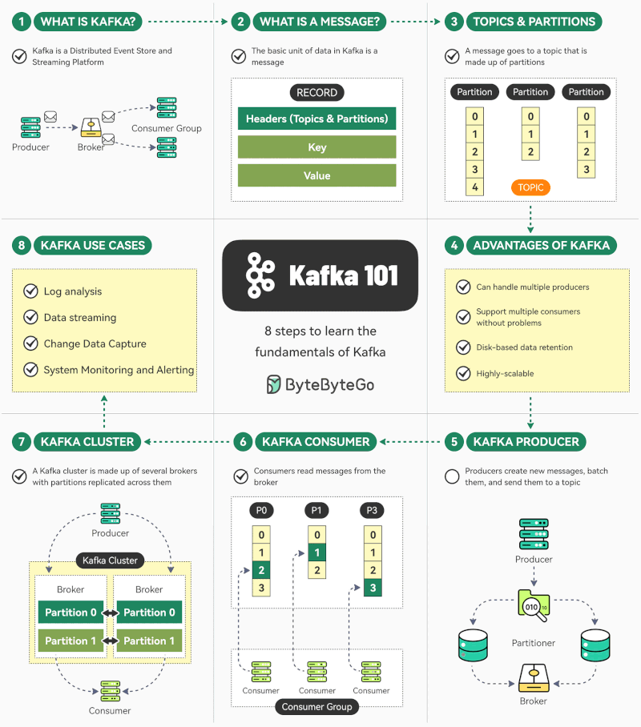

# Kafka

TODO: port Kafka notes here

<!-- INDEX_START -->

- [Nagios-Plugin-Kafka with Kerberos support](#nagios-plugin-kafka-with-kerberos-support)
- [Nagios Plugins for Kafka API written in Python & Perl](#nagios-plugins-for-kafka-api-written-in-python--perl)
- [Kafka on Kubernetes](#kafka-on-kubernetes)
- [Diagrams](#diagrams)
  - [Kafka Pub/Sub](#kafka-pubsub)
  - [Kafka Flink Elasticsearch](#kafka-flink-elasticsearch)
  - [Kafka 101](#kafka-101)

<!-- INDEX_END -->

## Nagios-Plugin-Kafka with Kerberos support

[nholuongut/Nagios-Plugin-Kafka](https://github.com/nholuongut/Nagios-Plugin-Kafka)

API monitoring plugin does full pub-sub unique message with Kerberos support. Written in [Scala](scala.md).

## Nagios Plugins for Kafka API written in Python & Perl

[nholuongut/Nagios-Plugins](https://github.com/nholuongut/Nagios-Plugins)

## Kafka on Kubernetes

<https://strimzi.io/>

## Diagrams

From the [nholuongut/Diagrams-as-Code](https://github.com/nholuongut/Diagrams-as-Code) repo:

### Kafka Pub/Sub

### Kafka Flink Elasticsearch

### Kafka 101

