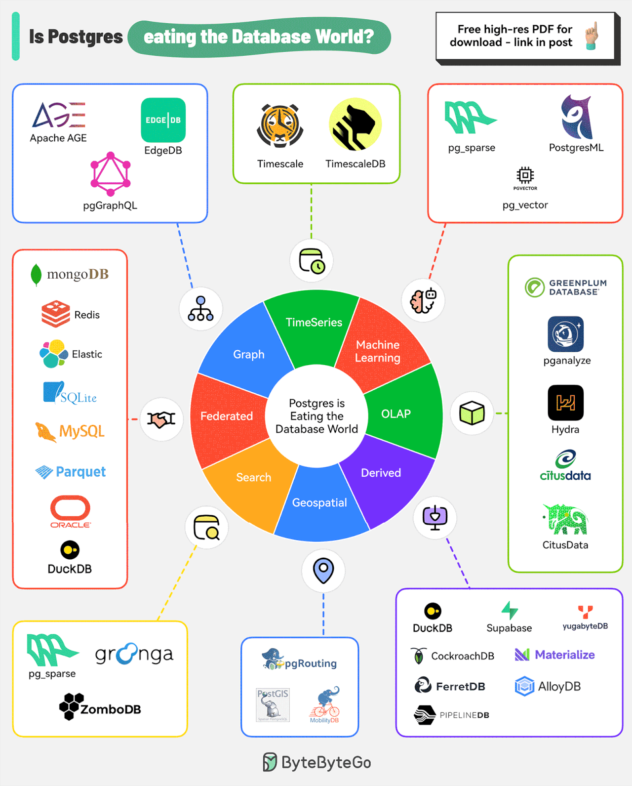

# PostgreSQL

<!-- INDEX_START -->

- [SQL Scripts](#sql-scripts)
- [PgAdmin](#pgadmin)

<!-- INDEX_END -->

## SQL Scripts

Scripts for DBA administration and performance engineering:

[nholuongut/SQL-scripts](https://github.com/nholuongut/SQL-scripts)

## PgAdmin

Web UI for DB access.

<https://www.pgadmin.org/>

<https://github.com/pgadmin-org/pgadmin4>

## Is Postgres eating the Database World

